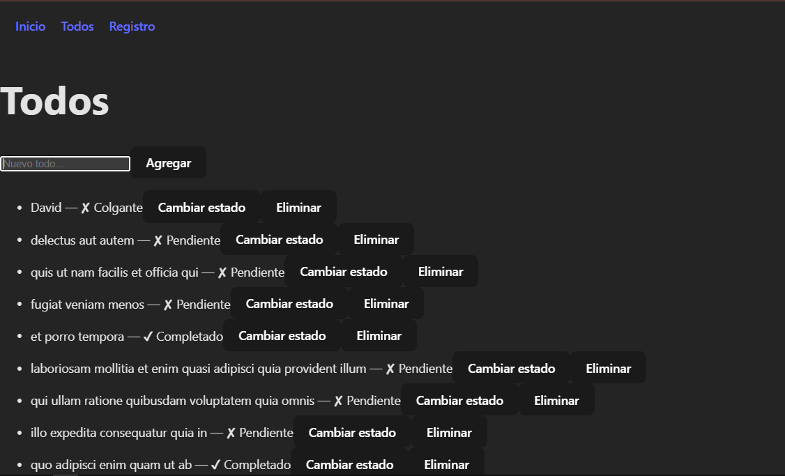
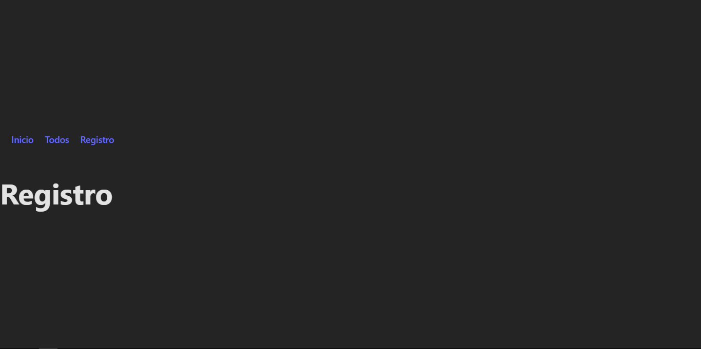

📝 Todo App – Actividad EV10 React

Aplicación desarrollada para la actividad GA1-220501096-03-AA1-EV10 donde se integran rutas, formularios controlados, consumo de datos desde API REST, validación, manejo de estados, carga, errores y lógica CRUD básica.

🚀 Tecnologías utilizadas
React + Vite

React Router DOM

JavaScript (ES6+)

Fetch API

Node.js

CSS básico

📌 Características principales
✅ Navegación entre rutas
La app contiene tres rutas principales:

/ → Página de inicio

/todos → Lista de tareas (Todos)

/registro → Formulario simple de registro

🗂️ Gestión de Todos (Tareas)
✔ Listado desde una API externa
Los primeros 10 todos provienen de:
https://jsonplaceholder.typicode.com/todos

✔ Crear nuevos todos
Mediante formulario controlado (TodoForm).

✔ Marcar como completado / pendiente
Botón que cambia el estado de cada todo.

✔ Eliminar un todo
Botón que elimina la tarea seleccionada.

✔ Validación básica
Evita agregar tareas vacías.

✔ Estados de carga
Muestra "Cargando..." mientras se obtiene la data.

✔ Manejo básico de errores
Atrapa errores en las peticiones con try/catch.

🧩 Estructura del proyecto
src/
 ├── components/
 │     └── TodoForm.jsx
 │
 ├── pages/
 │     ├── Home.jsx
 │     ├── Todos.jsx
 │     └── Registro.jsx
 │
 ├── App.jsx
 ├── main.jsx
 └── App.css
🛠️ Instalación y ejecución
Clonar el repositorio:

git clone https://github.com/tu-usuario/todo-app.git
Instalar dependencias:

npm install
Ejecutar la app en modo desarrollo:

npm run dev
Abrir en el navegador:

http://localhost:5173
📸 Vista previa
🟢 Lista de todos con botones individuales
🟢 Formularios sencillos y funcionales
🟢 Estados de carga y errores visibles
🧪 Reto pendiente (opcional)
✏ Editar todos

🔎 Filtros por estado

🔧 Mejorar el estilo visual

asi se veria la pagina 

inicio: 

todos con dato agregado llamado david : 

registro: 

👨‍💻 Autor
David Orozco
Actividad desarrollada para la evidencia EV10 – SENA.